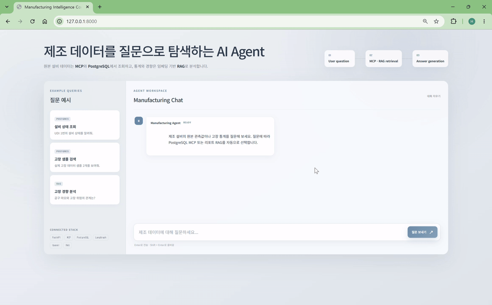

# Manufacturing MCP

제조 설비의 원본 관측값을 조회하고 고장 통계와 경향을 분석하는 AI Agent 프로젝트입니다. 질문에 따라 **PostgreSQL MCP Tool**로 원본 데이터를 조회하거나, **임베딩 기반 RAG**로 분석 리포트를 검색하여 답변합니다.


## Demo



원본 설비 데이터에 관한 질문은 **MCP·PostgreSQL**, 통계와 경향에 관한 질문은 **임베딩 기반 RAG**로 처리됩니다.


## 핵심 기능

- **원본 데이터 조회:** MCP Tool이 PostgreSQL의 설비 관측값을 UDI 또는 조건으로 조회합니다.
- **통계 계산:** Python과 SQLAlchemy로 전체 고장률, 제품 등급별 고장률, 공구 마모 구간별 고장률과 고장 유형을 계산합니다.
- **리포트 생성:** LangGraph가 검증된 통계를 바탕으로 세 종류의 분석 리포트를 병렬 생성합니다.
- **RAG 질의응답:** 리포트를 섹션 단위로 나누고 `text-embedding-3-small`로 미리 임베딩하여 관련 내용을 검색합니다.
- **통합 라우팅:** 질문 유형에 따라 PostgreSQL MCP 또는 리포트 RAG를 자동 선택합니다.
- **웹 데모:** FastAPI `/chat` API와 HTML·CSS·JavaScript 화면에서 전체 흐름을 실습할 수 있습니다.

## 동작 구조

```text
사용자 질문
   │
   ▼
통합 질문 라우터
   ├─ 원본 행·샘플 요청 ─▶ GPT-5-mini ─▶ MCP Tool ─▶ PostgreSQL
   └─ 통계·경향 질문 ───▶ 임베딩 검색 ─▶ GPT-5-mini ─▶ RAG 답변
```

통계 리포트는 실시간 질문 이전에 `PostgreSQL → Python 통계 → LangGraph → Markdown 리포트 → 임베딩 인덱스` 순서로 준비합니다. 구성 요소와 데이터 흐름은 [아키텍처 문서](docs/architecture.md)에서 자세히 설명합니다.

## 데이터셋

이 프로젝트는 **AI4I 2020 Predictive Maintenance Dataset**을 사용합니다. 실제 산업 현장의 예지보전 데이터를 모사한 합성 데이터셋으로, 총 10,000개의 설비 운전 관측값과 14개 열로 구성됩니다.

각 관측값에는 제품 등급, 공기 및 공정 온도, 회전 속도, 토크, 공구 마모 시간, 설비 고장 여부와 고장 유형이 기록되어 있습니다.

- **설비 상태 조회(Monitoring)**
- **고장 위험 분류(Classification)**
- **이상 조건 탐색(Anomaly Detection)**

컬럼, 입력·출력 레이블과 데이터 샘플은 [데이터셋 문서](docs/dataset.md)에서 확인할 수 있습니다.

## 개발 환경 구성

### 요구 사항

- WSL 2 Ubuntu 24.04
- Python 3.12
- Docker Desktop 및 WSL Integration
- OpenAI API Key

프로젝트 루트에서 가상환경을 활성화하고 프로젝트 및 개발 의존성을 설치합니다.

```bash
source mcp/bin/activate
python -m pip install --upgrade pip
python -m pip install -e ".[dev]"
```

`.env.example`을 복사하고 실제 OpenAI API Key를 입력합니다. `.env`는 Git에서 제외됩니다.

```bash
cp -n .env.example .env
chmod 600 .env
```


## 데이터 준비

PostgreSQL 실행, 테이블 생성, CSV 적재, 통계 계산, 리포트와 임베딩 인덱스 생성을 순서대로 수행합니다.

```bash
docker compose up -d postgres
alembic upgrade head
python -m manufacturing_mcp.pipeline.load_dataset
python -m manufacturing_mcp.analysis.statistics
python -m manufacturing_mcp.workflows.report
python -m manufacturing_mcp.rag.chunker
python -m manufacturing_mcp.rag.embeddings
```

각 명령의 입력·출력 파일과 확인 방법은 [파이프라인 문서](docs/pipeline.md), PostgreSQL 스키마와 조회 방법은 [PostgreSQL 문서](docs/postgres.md)를 참고합니다.

위 과정을 실행하면 다음 결과가 생성됩니다.

| 경로 | 내용 |
| --- | --- |
| `out/statistics.json` | PostgreSQL에서 계산한 재사용 가능 통계 |
| `reports/*.md` | GPT-5-mini가 작성한 고장·제품 등급·공구 마모 분석 리포트 |
| `out/report_chunks.json` | Markdown 섹션 단위의 검색 청크 |
| `out/report_embeddings.json` | 청크와 `text-embedding-3-small` 임베딩 인덱스 |

현재 생성하는 리포트는 `failure_summary.md`, `product_type_analysis.md`, `tool_wear_analysis.md`입니다.

## 사용 방법

### CLI

원본 데이터 질문과 분석 질문을 하나의 명령으로 실행할 수 있습니다. `--show-route`는 선택된 경로를 출력합니다.

```bash
python -m manufacturing_mcp.agent.chat \
  "실제 고장 데이터 샘플 2개 보여줘." \
  --show-route

python -m manufacturing_mcp.agent.chat \
  "공구 마모 시간이 길어질수록 고장 위험이 높아지니?" \
  --show-route
```

### Web

FastAPI로 채팅 API와 웹 화면을 함께 실행합니다.

```bash
python -m uvicorn manufacturing_mcp.api.app:app
```

서버 실행 후 브라우저에서 [http://127.0.0.1:8000](http://127.0.0.1:8000)에 접속합니다.

| 경로 | 메서드 | 역할 |
| --- | --- | --- |
| `/` | `GET` | 로컬 웹 데모 |
| `/health` | `GET` | 서버 상태 확인 |
| `/chat` | `POST` | 통합 제조 데이터 질의응답 |
| `/docs` | `GET` | Swagger API 문서 |

## 테스트

```bash
python -m pytest
```

테스트는 설정, 데이터 모델과 Repository, CSV 적재, 통계, LangGraph Workflow, 청킹·임베딩·검색, RAG 답변, MCP Tool, 통합 라우터와 FastAPI API를 검증합니다.

## 프로젝트 구조

```text
manufacturing-mcp/
├── data/                  # AI4I 2020 CSV
├── docs/                  # 데이터셋, DB, 아키텍처 및 실행 문서
├── migrations/            # Alembic 데이터베이스 마이그레이션
├── out/                   # 통계, 청크 및 임베딩 JSON
├── reports/               # LLM 생성 Markdown 리포트
├── src/manufacturing_mcp/ # 애플리케이션 소스 코드
├── tests/                 # 자동화 테스트
├── web/                   # 로컬 데모 HTML, CSS, JavaScript
├── compose.yaml           # PostgreSQL Docker Compose 구성
└── pyproject.toml         # 패키지 정보와 의존성
```

## 문서

- [아키텍처와 구성 요소](docs/architecture.md)
- [전체 실행 파이프라인](docs/pipeline.md)
- [PostgreSQL 실행 및 조회](docs/postgres.md)
- [데이터셋 컬럼과 샘플](docs/dataset.md)

## 출처 및 저작권

- 프로젝트 코드: Copyright © 2026 Johyeongseob. [MIT License](LICENSE)에 따라 배포됩니다.
- 데이터셋: *AI4I 2020 Predictive Maintenance Dataset* (2020), UCI Machine Learning Repository, [https://doi.org/10.24432/C5HS5C](https://doi.org/10.24432/C5HS5C)
- 관련 논문: Stephan Matzka, “Explainable Artificial Intelligence for Predictive Maintenance Applications,” *2020 Third International Conference on Artificial Intelligence for Industries (AI4I)*, pp. 69–74, [https://doi.org/10.1109/AI4I49448.2020.00023](https://doi.org/10.1109/AI4I49448.2020.00023)
- 데이터셋 라이선스: [Creative Commons Attribution 4.0 International(CC BY 4.0)](https://creativecommons.org/licenses/by/4.0/)
