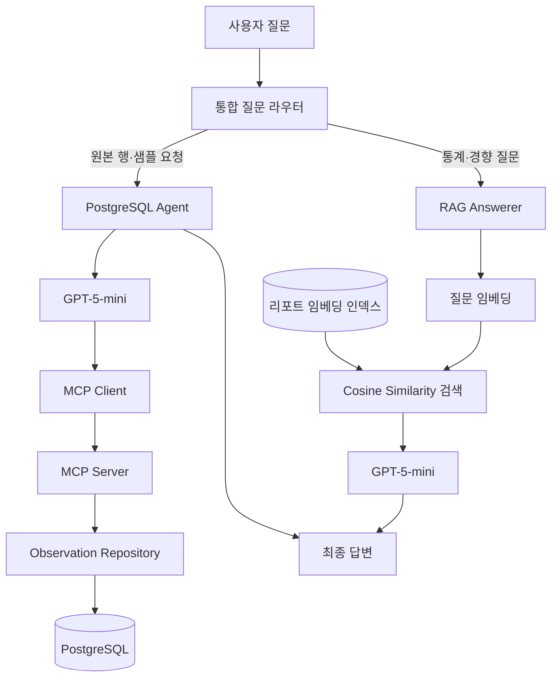
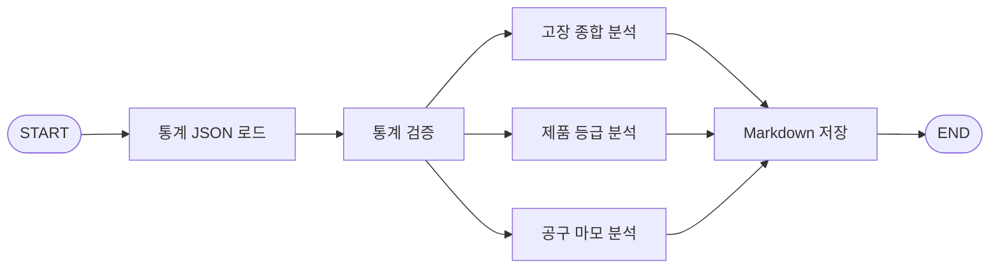

# 아키텍처

Manufacturing MCP는 원본 관측값 조회와 통계 기반 분석을 서로 다른 경로로 처리합니다. 원본 행은 PostgreSQL을 직접 조회하고, 전체 경향은 미리 생성한 분석 리포트를 검색하여 답변합니다.

## 전체 구조

## PostgreSQL 계층

`database/session.py`는 SQLAlchemy 비동기 엔진과 세션의 생명주기를 관리합니다. `database/repository.py`는 SQL 쿼리를 애플리케이션 로직에서 분리하고, `database/models.py`는 `observations` 테이블을 Python 객체로 표현합니다.

데이터베이스 구조 변경은 Alembic으로 관리합니다. `migrations/versions/20260823_0001_create_observations.py`가 `observations` 테이블, 제약조건과 인덱스를 생성합니다.

## MCP Server

`mcp_server/server.py`는 FastMCP 기반의 stdio 서버입니다. LLM이 임의의 SQL을 작성하는 대신 입력 범위가 제한된 읽기 전용 Tool을 호출합니다.

| Tool | 입력 | 반환 |
| --- | --- | --- |
| `get_observation` | 양의 정수 `udi` | 관측값과 고장 유형 한 건 |
| `search_observations` | 제품 등급, 고장 여부, 최소 공구 마모, 최대 행 수 | 조건에 맞는 관측값 목록 |

`search_observations`의 반환 행 수는 1–20개로 제한되어 대량 데이터가 모델 문맥에 들어가는 것을 방지합니다.

## 통계와 LangGraph

`analysis/statistics.py`는 PostgreSQL에서 다음 값을 계산하여 `out/statistics.json`에 저장합니다.

- 전체 관측값, 고장 건수와 고장률
- L·M·H 제품 등급별 관측값과 고장률
- 공구 마모 시간 구간별 관측값과 고장률
- TWF·HDF·PWF·OSF·RNF 고장 유형별 발생 건수

LangGraph Workflow는 통계를 불러오고 내부 일관성을 검증한 뒤 세 리포트 생성 노드를 실행합니다.

세 생성 노드는 서로 독립적이므로 병렬로 GPT-5-mini를 호출합니다. 저장 노드는 모든 결과가 준비된 뒤 `reports/`에 Markdown 파일을 기록합니다.

## RAG

RAG 인덱스는 다음 순서로 준비합니다.

1. Markdown 리포트를 `##` 섹션 기준으로 분할합니다.
2. 각 청크의 제목, 본문과 출처를 `out/report_chunks.json`에 저장합니다.
3. 각 청크를 `text-embedding-3-small`로 임베딩합니다.
4. 임베딩과 청크를 `out/report_embeddings.json`에 저장합니다.
5. 질문이 들어오면 질문 임베딩과 저장된 청크 임베딩의 코사인 유사도를 계산합니다.
6. 상위 `top-k` 청크만 GPT-5-mini의 근거 문맥으로 전달합니다.

리포트가 바뀌지 않는 동안 청크 임베딩은 다시 계산할 필요가 없습니다. 질문마다 새로 계산하는 것은 질문 임베딩 한 개입니다.

## 통합 라우터와 API

`agent/chat.py`는 UDI, 원본 행, 실제 데이터 샘플처럼 행 수준 조회가 명시된 질문을 PostgreSQL 경로로 보냅니다. 나머지 통계·경향 질문은 RAG 경로로 전달합니다.

`api/app.py`는 동일한 통합 로직을 `/chat`으로 공개하고 `web/`의 정적 데모 화면도 함께 제공합니다. API 응답에는 답변과 함께 실제로 선택된 `postgres` 또는 `rag` 경로가 포함됩니다.
